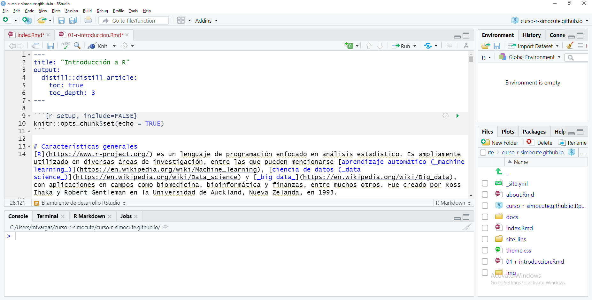

```{r setup, include=FALSE}
knitr::opts_chunk$set(echo = TRUE)
```

# El ambiente de desarrollo RStudio
[RStudio](https://www.rstudio.com/) es el IDE más popular para el lenguaje R. Está disponible en una versión de escritorio (RStudio Desktop) y en una versión para servidor (RStudio Server). Esta última permite la conexión de varios usuarios a través de un navegador web. RStudio se ofrece también como un servicio en la nube, a través de [RStudio Cloud](https://www.rstudio.com/products/cloud/). 

<figure>
  
  <figcaption>
    Interfaz de RStudio.
  </figcaption>
</figure>

Además de edición de código fuente en R (y otros lenguajes), RStudio contiene capacidades para depurar código y visualizar datos en formatos tabulares, gráficos y de mapas.


